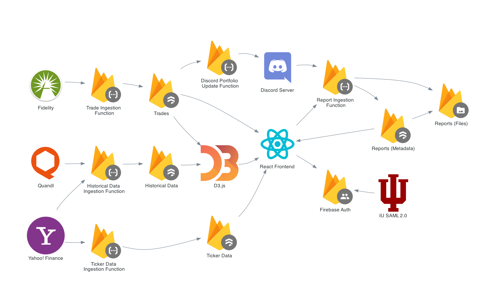

# Project Dalio <!-- omit in toc -->

Project Dalio is the [data warehouse](https://en.wikipedia.org/wiki/Data_warehouse) for the [Envision Capital Management Group (ECMG)](https://ecmg.us), a student managed 501(c)(3) fund at Indiana University.

- To learn more about the grand design, read our [plan](/docs/PLAN.md).
- For the specific challenges/features we're aiming to address, read our [user stories](docs/STORIES.md).

## Features
*TODO*

## Local Development
1. Clone the repository 
   
   `git clone https://github.com/ECMGIU/ProjectDalio.git && cd ProjectDalio`
   
2. Install packages with npm

   `npm install`
   
3. Install the Firebase CLI

   `npm install -g firebase-tools`

4. Start the local development server. **Be careful: we haven't gotten the database distinctions worked out yet, meaning you could be working with the production database.**

   `npm run start`
   
5. *Optional if you're not working on functions.* If need be, **in a second terminal** start the firebase emulators.

   `npm run emulators`
   
6. If you use VSCode, you should be prompted to install recommended extensions, and there are a few workspace settings defined in `.vscode`. I (Wade) haven't tested this, so I'm unsure if it works. Hopefully it does. If it doesn't you can just look at the files and make the changes manually.
