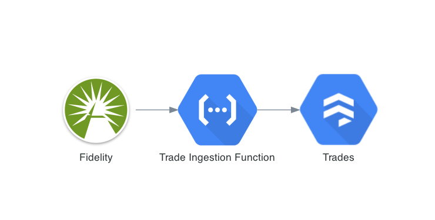
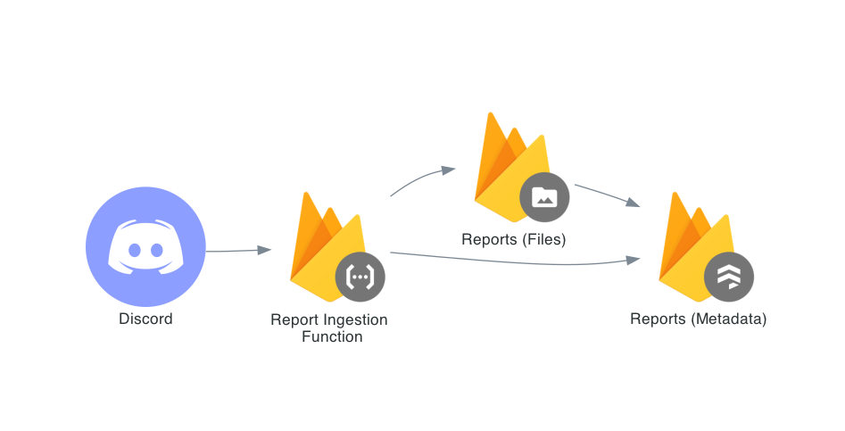
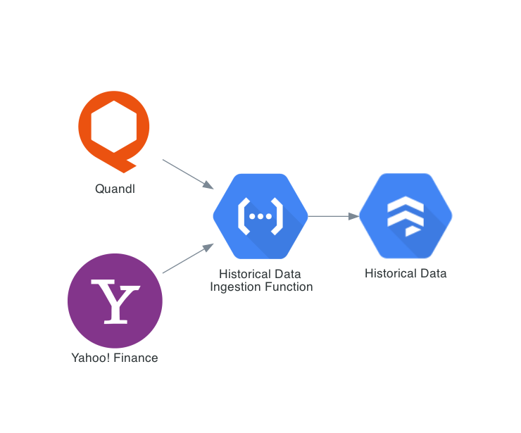

# ECMG Internal Website Planning <!-- omit in toc -->
*Wade Fletcher, 2021*

- [1. Stack](#1-stack)
- [2. Querys](#2-querys)
  - [2.1. Report Queries](#21-report-queries)
  - [2.2. User Queries](#22-user-queries)
  - [2.3. Trade Queries](#23-trade-queries)
  - [2.4. Cross-Collection Queries](#24-cross-collection-queries)
- [3. Collections (Database Architecture)](#3-collections-database-architecture)
  - [3.1. Users](#31-users)
  - [3.2. Trades](#32-trades)
  - [3.3. Reports](#33-reports)
    - [3.3.1. Feedback Subcollection](#331-feedback-subcollection)
  - [3.4. Historical Data](#34-historical-data)
- [4. Functions](#4-functions)
  - [4.1. Ingestion](#41-ingestion)
    - [4.1.1. Trades](#411-trades)
    - [4.1.2. Reports](#412-reports)
    - [4.1.3. Historical Data](#413-historical-data)
  - [4.2. Data Maintenence](#42-data-maintenence)
  - [4.3. Output](#43-output)
- [5. Analytics](#5-analytics)
- [6. Outstanding Questions](#6-outstanding-questions)

## 1. Stack
- Frontend: React ([Next.js](https://nextjs.org/))

- Hosting: [Firebase Hosting](https://firebase.google.com/products/hosting) ([Example](https://github.com/vercel/next.js/tree/canary/examples/with-firebase-hosting))

- Database: [Cloud Firestore](https://firebase.google.com/products/firestore)

- Storage: [Cloud Storage](https://firebase.google.com/products/storage)

  Used for report and image uploads, since we can't write files directly to the database.

- Serverless Functions: [Cloud Functions](https://firebase.google.com/products/functions)

  Used to automate common processes without having to stand up a dedicated server/API. Examples: Cleaning Fidelity CSVs, Collecting and Saving Historical Data, and saving reports to Storage and Metadata to Cloud Firestore in one API call.

- Authentication: [Firebase Authentication](https://firebase.google.com/products/auth)

  This is the real selling point because authentication with SAML is super simple, letting us tie right in with Duo and the rest of IU SAML.

- Analytics: [Google Analytics](https://firebase.google.com/products/analytics)

  Ties in real nice with Firebase, so why not?

## 2. Querys
Since we're using a NoSQL database (Cloud Firestore), rather than designing a database based on entities, (as we would with a relational database,) our design is rooted in our queries.

https://www.dataversity.net/how-to-design-schema-for-your-nosql-database/

### 2.1. Report Queries
- Recent Reports
- Reports for given trade
- Reports for a given ticker
- Reports for a given user
- Reports for a given team (I'm using team rather than sector/portfolio.)
- Metadata for a given Report
- Feedback for a given Report

### 2.2. User Queries
- Get current role of a given user
- Get current team of a given user
- Get all users in a given team
- Get all users of a given role

### 2.3. Trade Queries
- Currently open positions
- Current profit of open positions

### 2.4. Cross-Collection Queries
- Analyst performance
- Team performance

## 3. Collections (Database Architecture)
### 3.1. Users
| IU Username | Role    | Team           |
| ----------- | ------- | -------------- |
| wadefletch  | tpm     | technology     |
| samlicht    | analyst | domesticequity |
| apeddi      | analyst | sustainable    |
| ...         | ...     | ....           |

This super simple schema gives us simplicity with one cost, that users can't carry multiple roles/teams. Obviously there are exceptions to this rule (me until not long ago) but I believe that's an acceptable limitation. The increase in complexity and development time moving to a Many-to-One model here doesn't outweight the minimal benefit.

### 3.2. Trades
| Trade ID          | Quarter | Date       | Ticker | Action | Qty | Price | Commission | Fees | Amount  |
| ----------------- | ------- | ---------- | ------ | ------ | --- | ----- | ---------- | ---- | ------- |
| TR_IAU_1562889600 | Q3 2019 | 2019-07-12 | IAU    | BUY    | 10  | 13.52 |            |      | -135.25 |
| TR_IAU_1578268800 | Q1 2020 | 2020-01-06 | IAU    | BUY    | 4   | 15.07 |            |      | -60.28  |
| ...               | ...     | ...        | ...    | ...    | ... | ...   | ...        | ...  | ...     |

*Trade ID is TR_{Ticker}_{Epoch form of Date}.*

*Commission is only used for option transactions.*

*Fees are only incurred on SELL actions.*

### 3.3. Reports
| Report ID          | User       | Ticker | Timestamp  | URL         | Feedback                                    |
| ------------------ | ---------- | ------ | ---------- | ----------- | ------------------------------------------- |
| RE_INDA_1562889600 | wadefletch | INDA   | 2019-07-12 | https://... | *Feedback Subcollection (see §3.3.1 below)* |
| ...                | ...        | ...    | ...        | ...         | ...                                         |
*Report ID is RE_{Ticker}_{Epoch form of Date}.*

#### 3.3.1. Feedback Subcollection
| User     | Timestamp  | Comment                         |
| -------- | ---------- | ------------------------------- |
| sarnagar | 2019-07-12 | I've never seen a worse report. |
| ...      | ...        | ...                             |

### 3.4. Historical Data
Each Document will be a Ticker, so this is technically a subcollection.

| Date | Open | Low | High | Close | Volume |
| ---- | ---- | --- | ---- | ----- | ------ |
| ...  | ...  | ... | ...  | ...   | ...    |

*I felt this one was self-explanatory.*

## 4. Functions
### 4.1. Ingestion
#### 4.1.1. Trades
When we get new trade data from Fidelity, this function will take the body of the CSV file and write it into individual Documents on the Trades Collection. I already implemented the core logic for this in the [Master Trade Ledger Google Sheet](https://docs.google.com/spreadsheets/d/1hmaPz5sL_8HmIBEJXbW8h6fERes7gXg7QC8KmoGRmjg/edit#gid=112027560).

#### 4.1.2. Reports
When an analyst has a new report, we need to collect both the PDF itself and metadata surrounding it: Ticker, Analyst, etc. In it's simplest form, this would require two sequential API calls, one to Cloud Storage with the file, and then one to the Reports Collection with the Metadata, including the URL of the file download.

In our React frontend, we can access this function directly through the firebase package in a single function. However, by abstracting these two actions to a single function, we can also access them via an HTTP request. This opens up a cool project: we can ingest reports into the system through a discord bot.

#### 4.1.3. Historical Data
Currently, our historical data is pulled through the =GOOGLEFINANCE function on Google Sheets, which is free but super slow. Sunny has been working on alternative sources for our historical data, [which are already being ingested into Firestore](https://github.com/ECMGIU/HistoricalData). We'll continue to expand this, put it into a serverless function, and further automate the process in three ways.
  1. Timed updates (hourly, daily, whatever we want it to be) (Cost $0.10/job/month)
  2. Automated selection (pulling exactly the hisotrical data we need, without configuration)
  3. Intelligent querying (allowing more dynamic querying)

### 4.2. Data Maintenence
Since we've chosen NoSQL, we're going to carry a lot of redundant data through the structure. *This is intentional.* What this means, is we're going to denormalize (duplicate) data across different tables. For those of you with a strong relational background (K204, anyone?) this sounds egregious. *I know.* What this allows though is an extremely simplified set of API calls that are incredibly performant. It's actually been used for a long time to achieve better performance in SQL queries, by minimizing the JOINs that occur on any particular request.

The cost of this though, is when we update a record, we've also got to update everywhere else that data is replicated. We'll do this through another set of cloud functions, one for each [Collection](#3-collections-database-architecture).

### 4.3. Output
In the longer term, I think we can start automating production of some deliverables. A couple ideas:
- Use report feedback to compile a monthly selection of the best reports.
- Build report books for exec meetings.
- Post portfolio updates in Discord at some regular interval.
- Congratulate analysts who outperform their peers.

## 5. Analytics
*In this context, "Analytics" refers to tracking the pageviews, button clicks, uploads, logins, etc. within our application, rather than the portfolio analytics we've been doing.*

## 6. Outstanding Questions
1. How frequently do we need portfolio performance data updated? I say daily, because intraday is going to be expensive and if you really need intraday, just log in to Fidelity. If we do daily, we can just set up functions that keep everything updated at EOD.