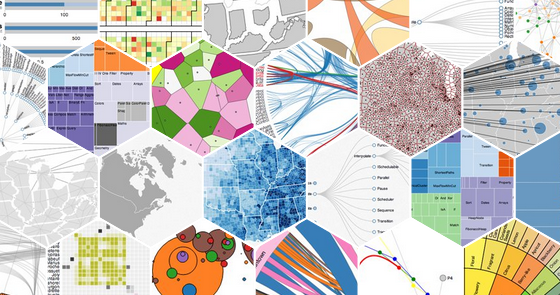

# Project Dalio <!-- omit in toc -->
*Wade Fletcher, 2021*

- [1. Tech Stack](#1-tech-stack)
- [2. Queries](#2-queries)
  - [2.1. Report Queries](#21-report-queries)
  - [2.2. User Queries](#22-user-queries)
  - [2.3. Trade Queries](#23-trade-queries)
  - [2.4. Task Queries](#24-task-queries)
  - [2.5. Performance Queries](#25-performance-queries)
- [3. Collections (Database Architecture)](#3-collections-database-architecture)
  - [3.1. Users](#31-users)
  - [3.2. Trades](#32-trades)
  - [3.3. Reports](#33-reports)
    - [3.3.1. Feedback Subcollection](#331-feedback-subcollection)
  - [3.4. Historical Data](#34-historical-data)
  - [3.5. Ticker Data](#35-ticker-data)
  - [3.6. Tasks](#36-tasks)
- [4. Functions](#4-functions)
  - [4.1. Ingestion](#41-ingestion)
    - [4.1.1. Trades](#411-trades)
    - [4.1.2. Reports](#412-reports)
    - [4.1.3. Historical Data](#413-historical-data)
    - [4.1.4. Ticker Data](#414-ticker-data)
  - [4.2. Data Maintenence](#42-data-maintenence)
    - [4.2.1. Dues Marking](#421-dues-marking)
  - [4.3. Output](#43-output)
- [5. Authentication](#5-authentication)
- [6. Visualization](#6-visualization)
- [7. Frontend](#7-frontend)
  - [7.1. React](#71-react)
  - [7.2. Tailwind CSS](#72-tailwind-css)
- [8. Outstanding Questions](#8-outstanding-questions)


## 1. Tech Stack
- Frontend: [React](https://reactjs.org/)

  Developed by [Facebook](https://www.facebook.com/), React is the best frontend framework on the market right now. In addition to being the best out there, a *ton* of the CS job market right now is React-adjacent if not hands-on React, so I think this will be valuable experience career-wise.

- Hosting: [Firebase Hosting](https://firebase.google.com/products/hosting)

  Free hosting on the same servers that host Google.

- Database: [Cloud Firestore](https://firebase.google.com/products/firestore)

  Used for storage of all of our [Collections](#3-collections-database-architecture)

- Storage: [Cloud Storage](https://firebase.google.com/products/storage)

  Used for report and image uploads, since we can't write files directly to the database.

- Serverless Functions: [Cloud Functions](https://firebase.google.com/products/functions)

  Used to automate common processes without having to stand up a dedicated server/API. Examples: Cleaning Fidelity CSVs, Collecting and Saving Historical Data, and saving reports to Storage and Metadata to Cloud Firestore in one API call.

- Authentication: [Firebase Authentication](https://firebase.google.com/products/auth)

  This is the real selling point because authentication with SAML is super simple, letting us tie right in with Duo and the rest of IU SAML.

- Analytics: [Google Analytics](https://firebase.google.com/products/analytics)

  Ties in real nice with Firebase, so why not?


## 2. Queries
Since we're using a NoSQL database (Cloud Firestore), rather than designing a database based on entities, (as we would with a relational database,) our design is rooted in our queries.

This is intended to be an exhaustive and updated list of everything we could pull out of the database.

https://www.dataversity.net/how-to-design-schema-for-your-nosql-database/

### 2.1. Report Queries
- Recent Reports
- Reports for given trade
- Reports for a given ticker
- Reports for a given user
- Reports for a given team (I'm using team rather than sector/portfolio.)
- Metadata for a given Report
- Feedback for a given Report

### 2.2. User Queries
- Get role of a given user
- Get team of a given user
- Get dues status of a given user
- Get all users in a given team
- Get all users of a given role
- Get all users with paid/unpaid dues

### 2.3. Trade Queries
- Currently open positions
- Current profit of open positions

### 2.4. Task Queries
- Get all tasks for a given user

### 2.5. Performance Queries
- Analyst performance
- Team performance
- Fund performance

## 3. Collections (Database Architecture)
Currently, these *do not* contain denormalized data. I've also made some other concessions for simplicity at this stage, e.g. only using usernames, rather than full names.


### 3.1. Users
| IU Username | Role    | Team           | Dues  |
| ----------- | ------- | -------------- | ----- |
| wadefletch  | tpm     | technology     | TRUE  |
| samlicht    | analyst | domesticequity | FALSE |
| apeddi      | analyst | sustainable    | TRUE  |
| ...         | ...     | ....           | ...   |

This super simple schema gives us simplicity with one cost, that users can't carry multiple roles/teams. Obviously there are exceptions to this rule (me until not long ago) but I believe that's an acceptable limitation. The increase in complexity and development time moving to a Many-to-One model here doesn't outweight the minimal benefit.

### 3.2. Trades
| Trade ID          | Date       | Ticker | Action | Qty | Price | Commission | Fees | Amount  |
| ----------------- | ---------- | ------ | ------ | --- | ----- | ---------- | ---- | ------- |
| TR_IAU_1562889600 | 2019-07-12 | IAU    | BUY    | 10  | 13.52 |            |      | -135.25 |
| TR_IAU_1578268800 | 2020-01-06 | IAU    | BUY    | 4   | 15.07 |            |      | -60.28  |
| ...               | ...        | ...    | ...    | ... | ...   | ...        | ...  | ...     |

*Trade ID is TR_{Ticker}_{Epoch form of Date}.*

*Commission is only used for option transactions.*

*Fees are only incurred on SELL actions.*

### 3.3. Reports
| Report ID          | User       | Ticker | Timestamp  | Title                  | URL         | Feedback                                    |
| ------------------ | ---------- | ------ | ---------- | ---------------------- | ----------- | ------------------------------------------- |
| RE_INDA_1562889600 | wadefletch | INDA   | 2019-07-12 | Opportunities in India | https://... | *Feedback Subcollection (see §3.3.1 below)* |
| ...                | ...        | ...    | ...        | ...                    | ...         | ...                                         |

*Report ID is RE_{Ticker}_{Epoch form of Date}.*

#### 3.3.1. Feedback Subcollection
| User     | Timestamp  | Body                            |
| -------- | ---------- | ------------------------------- |
| sarnagar | 2019-07-12 | I've never seen a worse report. |
| ...      | ...        | ...                             |

### 3.4. Historical Data
Each Document will be a Ticker, so this is technically a subcollection.

| Date | Open | Low | High | Close | Volume |
| ---- | ---- | --- | ---- | ----- | ------ |
| ...  | ...  | ... | ...  | ...   | ...    |

*I felt this one was self-explanatory.*

### 3.5. Ticker Data
| Ticker | Company Name          | Exchange | Type   |
| ------ | --------------------- | -------- | ------ |
| AAPL   | Apple Inc.            | NASDAQ   | Equity |
| MSFT   | Microsoft Corporation | NASDAQ   | Equity |
| QQQ    | Invesco QQQ Trust     | NASDAQ   | ETF    |
| ...    | ...                   | ...      | ...    |

### 3.6. Tasks
| User       | Task                     | Description | Completed? |
| ---------- | ------------------------ | ----------- | ---------- |
| wadefletch | Weekly Report Submission | ...         | FALSE      |
| ...        | ...                      | ...         | ...        |

*Currently these wil have to be checked off manually by the assignee once completed, I'm not sure how to automate most of them.*

Standard tasks could include:
- Tagging new trades with relevant reports, analysts, and PM
- Submitting reports

## 4. Functions
### 4.1. Ingestion
We're bringing in a lot of data here, from a bunch of different places
- Financial Data from [Google Finance](https://www.google.com/finance), [Yahoo Finance](https://finance.yahoo.com/), and [Quandl](https://www.quandl.com/)
- Portfolio Data from [Fidelity](https://www.fidelity.com/)
- Reports from Analysts
- Association Data from *(whoever ends up being in charge of this)*

#### 4.1.1. Trades
When we get new trade data from Fidelity, this function will take the body of the CSV file and write it into individual Documents on the Trades Collection. I already implemented the core logic for this in the [Master Trade Ledger Google Sheet](https://docs.google.com/spreadsheets/d/1hmaPz5sL_8HmIBEJXbW8h6fERes7gXg7QC8KmoGRmjg/edit#gid=112027560). It's not clear whether we'll be able to automate pulling from Fidelity (that would be ideal) or whether we'll need a TextArea or similar which can be pasted into.


#### 4.1.2. Reports
When an analyst has a new report, we need to collect both the PDF itself and metadata surrounding it: Ticker, Analyst, etc. In it's simplest form, this would require two sequential API calls, one to Cloud Storage with the file, and then one to the Reports Collection with the Metadata, including the URL of the file download.

In our React frontend, we can access this function directly through the firebase package in a single function. However, by abstracting these two actions to a single function, we can also access them via an HTTP request. This opens up a cool project: we can ingest reports into the system through a discord bot.


#### 4.1.3. Historical Data
Currently, our historical data is pulled through the `=GOOGLEFINANCE` function on Google Sheets, which is free but super slow. Sunny has been working on alternative sources for our historical data, [which are already being ingested into Firestore](https://github.com/ECMGIU/HistoricalData). We'll continue to expand this, put it into a serverless function, and further automate the process in three ways.
  1. Timed updates (hourly, daily, whatever we want it to be) (Cost $0.10/job/month)
  2. Automated selection (pulling exactly the hisotrical data we need, without configuration)
  3. Dynamic querying (far better insights than Google Sheets)


#### 4.1.4. Ticker Data
We'll probably want to refer to companies with their full names and exchanges at some point, not just tickers. Yahoo Finance makes this data available to us via the following endpoint.
```
http://autoc.finance.yahoo.com/autoc?lang=en&query={Ticker}
```


### 4.2. Data Maintenence
Since we've chosen NoSQL, we're going to carry a lot of redundant data through the structure. *This is intentional.* What this means, is we're going to denormalize (duplicate) data across different Collections and Documents. For those of you with a strong relational background (K204, anyone?) this sounds egregious. *I know.* What this allows though is an extremely simplified set of API calls that are incredibly performant. It's actually been used for a long time to achieve better performance in SQL queries, by minimizing the JOINs that occur on any particular request.

The cost of this though, is when we update a Document, we've also got to update everywhere else that data is replicated. We'll do this through another set of cloud functions, one for each [Collection](#3-collections-database-architecture).

#### 4.2.1. Dues Marking
When a member successfully pays dues on Stripe, we can set up a webhook URL that will get hit. That webhook URL will point to this function, which will mark them as dues paid in their User Document.

### 4.3. Output
In the longer term, I think we can start automating production of some deliverables. A couple ideas:
- Use report feedback to compile a monthly selection of the best reports, complete with dynamically generated graphs and such.
- Build report books for exec meetings.
- Post portfolio updates in Discord at some regular interval.
- Congratulate analysts who outperform their peers.

## 5. Authentication
Obviously we're going to be dealing with some sensitive (though not necessarily private) data here, and we dont want everything available to everybody. A major factor in our decision to use Firebase was how [easily it integrates](https://cloud.google.com/identity-platform/docs/web/saml) with [IU's SAML login](https://kb.iu.edu/d/bdag).


Meaning, you'll be able to log in to this platform just like you do Canvas, iGPS, One.IU and every other IU service and we'll have the same protections (2FA through Duo) as the rest of the university.


## 6. Visualization
The name of the game and one of the big end goals here is visualization.



[D3.js](https://d3js.org/) is the name of the game here, and the prominent frontend charting library *du jour*.

Examples (with code):
- [Calendar Heatmap](https://observablehq.com/@d3/calendar-view)
- [Line Chart](https://observablehq.com/@d3/line-chart) (uses Yahoo Finance data)
- [Candlestick Chart](https://observablehq.com/@d3/candlestick-chart) (also YF)
- [Bollinger Bands](https://observablehq.com/@d3/bollinger-bands)
- [Pie Chart](https://observablehq.com/@d3/pie-chart)

I've never worked with D3 (never done any dataviz from scratch) but I've continuously heard good things about it and I'm excited to put it to use here.

## 7. Frontend
### 7.1. React
I think React is the right way to go for this project, because it plays so nice with Firebase and is very much the libary of the day.


*[Source](https://existek.com/blog/top-front-end-frameworks-2020/)*

I know this adds some degree of complexity over something like [Flask](https://flask.palletsprojects.com/en/1.1.x/) or [Django](https://www.djangoproject.com/), but it allows us to radically simplify auth (Firebase handles [JWTs](https://jwt.io/introduction) <10 lines of code with React) and I think we have more React frontend experience on our team than [Jinja2](https://jinja.palletsprojects.com/en/2.11.x/). 

### 7.2. Tailwind CSS


I'm also a huge fan of [Tailwind CSS](https://tailwindcss.com/). This project (despite the name) almost completely removes the need to write CSS. I'd *highly* encourage you to read through the landing page, it's pretty sick. This is an open source project I contribute to and I'm a big believer and evangelist for it.

I also have access to the [Tailwind UI](https://tailwindui.com/components) component library, which is a little limited at present but is a good resource for what's possible in Tailwind. 

[Here are some examples of familiar UIs (Spotify, Shopify, Netlify, etc.) implemented in Tailwind.](https://github.com/asvny/building-realworld-user-interfaces-using-tailwind)

## 8. Outstanding Questions
1. How frequently do we need portfolio performance data updated? I say daily, because intraday is going to be expensive and if you really need intraday, just log in to Fidelity. If we do daily, we can just set up functions that keep everything updated at market close.
~~2. What are we going to call this thing? We can do better than "Internal Website." Can we give it a "Project X" name?~~ Sarthak and I have elected to call this "Project Dalio" for the time being, after [Ray Dalio](https://en.wikipedia.org/wiki/Ray_Dalio) and his [data-driven principles](https://www.toptal.com/finance/business-plan-consultants/ray-dalio-principles).
