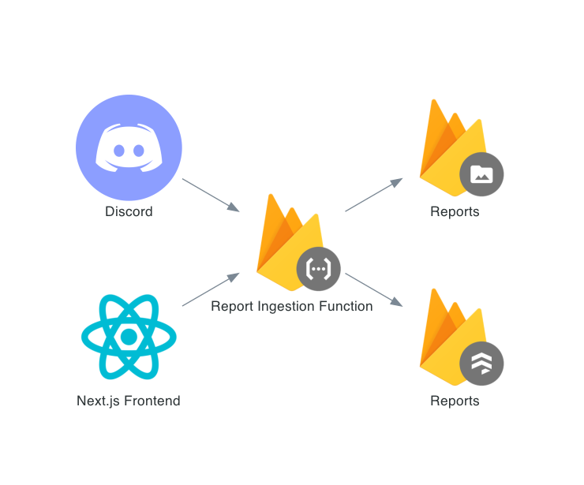

# ECMG Internal Website Planning <!-- omit in toc -->

- [1. Stack](#1-stack)
- [2. Querys](#2-querys)
  - [2.1. Report Queries](#21-report-queries)
  - [2.2. User Queries](#22-user-queries)
  - [2.3. Trade Queries](#23-trade-queries)
  - [2.4. Cross-Collection Queries](#24-cross-collection-queries)
- [3. Functions](#3-functions)
  - [3.1. Ingestion](#31-ingestion)
    - [3.1.1. Trades](#311-trades)
    - [Reports](#reports)

## 1. Stack
- Frontend: React ([Next.js](https://nextjs.org/))

- Hosting: [Firebase Hosting](https://firebase.google.com/products/hosting) ([Example](https://github.com/vercel/next.js/tree/canary/examples/with-firebase-hosting))

- Database: [Cloud Firestore](https://firebase.google.com/products/firestore)

- Storage: [Cloud Storage](https://firebase.google.com/products/storage)

  Used for report and image uploads, since we can't write files directly to the database.

- Serverless Functions: [Cloud Functions](https://firebase.google.com/products/functions)

  Used to automate common processes without having to stand up a dedicated server/API. Examples: Cleaning Fidelity CSVs, Collecting and Saving Historical Data, and saving reports to Storage and Metadata to Cloud Firestore in one API call.

- Authentication: [Firebase Authentication](https://firebase.google.com/products/auth)

  This is the real selling point because authentication with SAML is super simple, letting us tie right in with Duo and the rest of IU SAML.

- Analytics: [Google Analytics](https://firebase.google.com/products/analytics)

  Ties in real nice with Firebase, so why not?

## 2. Querys
Since we're using a NoSQL database (Cloud Firestore), rather than designing a database based on entities, (as we would with a relational database,) our design is rooted in our queries.

https://www.dataversity.net/how-to-design-schema-for-your-nosql-database/

### 2.1. Report Queries
- Recent Reports
- Reports for given trade
- Reports for a given ticker
- Reports for a given user
- Reports for a given team (I'm using team rather than sector/portfolio.)
- Metadata for a given Report
- Feedback for a given Report

### 2.2. User Queries
- Role for given user
- Get all members of a team ([may need a Team collection](https://medium.com/firebase-developers/how-to-build-a-team-based-user-management-system-with-firebase-6a9a6e5c740d))
- Get current team of a given user

### 2.3. Trade Queries
- Currently open positions
- Current profit of open positions

### 2.4. Cross-Collection Queries
- Analyst performance
- Team performance

## 3. Functions
### 3.1. Ingestion
#### 3.1.1. Trades
When we get new trade data from Fidelity, this function will take the body of the CSV file and write it into individual Documents on the Trades Collection. I already implemented the core logic for this in the [Master Trade Ledger Google Sheet](https://docs.google.com/spreadsheets/d/1hmaPz5sL_8HmIBEJXbW8h6fERes7gXg7QC8KmoGRmjg/edit#gid=112027560).

#### Reports
When an analyst has a new report, we need to collect both the PDF itself and metadata surrounding it: Ticker, Analyst, etc. In it's simplest form, this would require two sequential API calls, one to Cloud Storage with the file, and then one to the Reports Collection with the Metadata, including the URL of the file download.

In our React frontend, we can access this function directly through the firebase package in a single function. However, by abstracting these two actions to a single function, we can also access them via an HTTP request. This opens up a cool project: we can ingest reports into the system through a discord bot.

